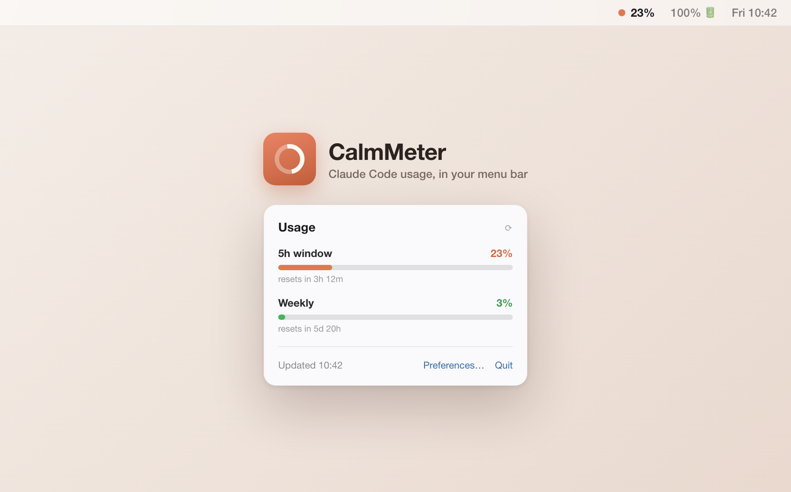

# CalmMeter

*A calm read on how much Claude Code you have left — right in your menu bar.*

CalmMeter is a tiny macOS **menu-bar app** that keeps your current **Claude Code
usage** in view — the same data as the `/usage` command: how much of your
**5-hour** and **weekly** rate-limit windows you've used, when they reset, and
optionally a per-model breakdown and spend. No more opening a terminal to check.

A [CalmBit](https://calmbit.cz) app.



## Requirements

- **macOS 13** (Ventura) or newer.
- A **Claude account** (Pro/Max subscription). Claude Code is **not** required:
  - If you use **Claude Code** on this Mac, CalmMeter picks up its login
    automatically — zero setup.
  - Otherwise, click **Sign in with Claude** in the app and approve in the
    browser (see "Signing in" below).
- To **build from source:** the Swift toolchain (Xcode or the Command Line Tools —
  `xcode-select --install`).

## Install

### Option A — download the DMG (easiest)

1. Grab `CalmMeter.dmg` from the [Releases](../../releases) page.
2. Open it and drag **CalmMeter** to **Applications**.
3. Launch it from Applications. If macOS warns it's from an unidentified
   developer, right-click the app → **Open** → **Open** (only needed once, and
   not at all if the DMG was notarized).

### Option B — build from source

```bash
git clone https://github.com/calmbit-sro/CalmMeter.git && cd CalmMeter
swift test               # optional: run the unit tests
./scripts/build-app.sh   # produces ./CalmMeter.app
open ./CalmMeter.app

# or install into /Applications:
./scripts/build-app.sh --install
```

### Signing in (no Claude Code needed)

If you don't use Claude Code on this Mac, the menu panel shows **Sign in with
Claude**:

1. Click it — your browser opens claude.ai's authorization page.
2. Approve access and copy the code the page shows (a `CODE#STATE` string).
3. Paste it back into CalmMeter's sign-in window.

CalmMeter stores the resulting credentials in its own keychain item
(`com.calmbit.CalmMeter.oauth`) and keeps them fresh by itself. **Sign out** is
in Preferences → Account.

### First launch with Claude Code — keychain prompt

If you *do* use Claude Code and don't sign in explicitly, CalmMeter reads the
token Claude Code stores in your login keychain. On first run macOS may show a
keychain dialog asking for access to **`Claude Code-credentials`** — click
**Allow**. CalmMeter then copies the token into its **own** keychain item
(`com.calmbit.CalmMeter.credentials`) and reads from there afterwards, so it
won't keep prompting on every launch — it only goes back to Claude Code's item
when the token stops working (roughly once per token rotation).

Nothing is sent anywhere except requests to Anthropic (your *own* usage, and —
only when you use the explicit sign-in — the OAuth token endpoint). No
analytics, no third parties.

## Using it

Click the menu-bar item to open the panel:

- **5h window** and **Weekly** utilization bars with reset countdowns
- **Refresh now**, **Preferences…**, **Quit**

### Preferences (everything is configurable)

- **Menu-bar format:** dot + 5h % (default) · 5h % only · `5h % · weekly %` · dot only
- **Refresh interval:** 30 s · 60 s (default) · 5 min
- **Launch at login** (on by default)
- **Per-model breakdown** in the panel (Opus/Sonnet…)
- **Colour thresholds** (green / orange / red)

## Building a signed DMG for distribution

`scripts/make-dmg.sh` builds, signs, and packages a `.dmg`. Sign it with your own
Apple **Developer ID** so it runs on other Macs.

```bash
# Auto-detects a "Developer ID Application" identity in your keychain:
./scripts/make-dmg.sh

# …or specify it explicitly:
./scripts/make-dmg.sh --sign "Developer ID Application: Your Name (TEAMID)"
```

**Notarize** (recommended so users don't see Gatekeeper warnings). Store your
Apple ID credentials once, then pass the profile name:

```bash
xcrun notarytool store-credentials calmmeter \
  --apple-id you@example.com --team-id TEAMID --password <app-specific-password>

./scripts/make-dmg.sh --sign "Developer ID Application: Your Name (TEAMID)" \
                      --notarize calmmeter
```

Notes:
- App-specific password: create one at <https://account.apple.com> → Sign-In & Security.
- Change the bundle id with `--identifier your.bundle.id` if you like
  (default `com.calmbit.CalmMeter`).
- Without a Developer ID the script falls back to an **ad-hoc** signature — that
  DMG runs only on the Mac that built it.

### Automated releases (GitHub Actions)

`.github/workflows/release.yml` builds, signs, notarizes, and attaches
`CalmMeter.dmg` to the GitHub release whenever you push a `v*` tag:

```bash
git tag v1.1.0 && git push origin v1.1.0
```

It needs these repository secrets (Settings → Secrets and variables → Actions):

| Secret | What |
|---|---|
| `MACOS_CERT_P12_BASE64` | base64 of your Developer ID Application `.p12` (`base64 -i cert.p12 \| pbcopy`) |
| `MACOS_CERT_PASSWORD` | password set when exporting the `.p12` |
| `NOTARY_APPLE_ID` | Apple ID email for notarization |
| `NOTARY_TEAM_ID` | Developer Team ID |
| `NOTARY_PASSWORD` | app-specific password |

## The app icon

`scripts/make-icon.py` renders the icon (a warm coral squircle with a usage-gauge
ring and a centre sunburst) at 1024px and builds `Resources/AppIcon.icns`. Tweak
the colours / fill in that script and re-run it to regenerate.

## How it works

- Two credential sources, in priority order:
  1. **Your own sign-in** (if you used *Sign in with Claude*): CalmMeter holds
     its own OAuth credentials in `com.calmbit.CalmMeter.oauth` and refreshes
     the access token itself shortly before it expires.
  2. **Claude Code's token** (zero-config fallback): read from the login
     keychain (service `Claude Code-credentials`) and cached in CalmMeter's own
     item so it doesn't re-prompt on every launch. Claude Code keeps this token
     fresh; on a 401 CalmMeter re-reads the item once.
- Calls `GET https://api.anthropic.com/api/oauth/usage` with the bearer token.
- On errors it backs off (honouring `Retry-After` for HTTP 429) and keeps showing
  the last known values instead of hammering the server.

> **Dev builds & signing:** `build-app.sh` signs with your Developer ID if it can
> find one (falling back to ad-hoc). A stable signature matters — ad-hoc builds
> get less predictable keychain behaviour.

## Project layout

- `Sources/CalmMeterCore/` — models, API client, keychain, polling store (unit-tested)
- `Sources/CalmMeter/` — the SwiftUI menu-bar app (`MenuBarExtra`)
- `Tests/CalmMeterCoreTests/` — unit tests + a sample API response fixture
- `scripts/build-app.sh` — assemble `CalmMeter.app`
- `scripts/make-dmg.sh` — build a signed (and optionally notarized) DMG
- `scripts/make-icon.py` — regenerate the app icon

## Uninstall

Quit the app, delete `CalmMeter.app`, and remove it from **System Settings →
General → Login Items** if you enabled launch-at-login.

---

CalmMeter is an independent tool and is not affiliated with or endorsed by Anthropic.
"Claude" and "Claude Code" are trademarks of Anthropic.
